<div align=center>
  <h1>
  Denoising Diffusion Probabilistic Models (DDPM)
  </h1>
  <p>
    <b>NYCU: Image and Video Generation (2026 Fall)</b><br>
    Programming Assignment 1
  </p>
</div>

<div align=center>
  <p>
    Instructor: <b>Yu-Lun Liu</b> &nbsp;|&nbsp; TA: <b>Yi-Ruei Liu</b>
  </p>
</div>

<div align=center>
  
  
  
  
  
  
  
  
  <p><i>Unconditional AFHQ samples at 64×64 — linear schedule, noise predictor, FID 8.29</i></p>
</div>

---

## 📘 Overview

A from-scratch implementation of **DDPM**, studied at two scales.

**Task 1 — Swiss Roll.** A DDPM over a 2D toy distribution, where the forward corruption and the
learned distribution can both be plotted directly. Small enough to serve as a correctness check on
the core algorithm before scaling up.

**Task 2 — Image generation.** The same formulation applied to AFHQ animal faces at 64×64,
evaluated by FID. Two axes are explored beyond the baseline: the **beta schedule**
(linear / quadratic / cosine) and the **prediction target** (noise / x₀ / posterior mean).

Full write-up with all derivations: **[`report/main.pdf`](./report/main.pdf)**.

---

## 🎯 Task 1 — Swiss Roll

### Forward process

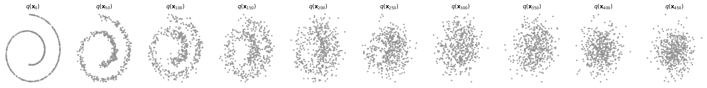

`q(x_t | x_0)` visualized every 50 timesteps. Both arms are still separable at t ≈ 50, the spiral
breaks into a diffuse ring around t ≈ 150–200, and from t ≈ 300 onwards nothing is left but a
centred isotropic blob.

### Training and sampling

<table>
<tr>
<td width="50%">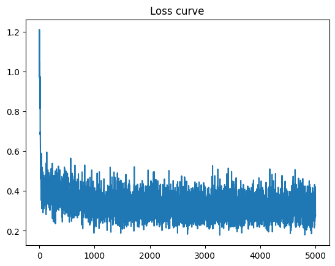</td>
<td width="50%">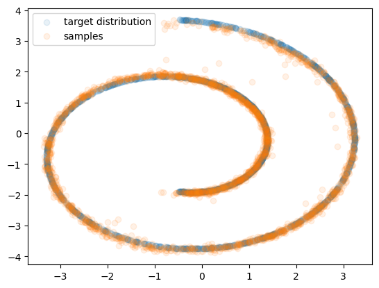</td>
</tr>
<tr>
<td align="center"><i>Training loss over 5000 iterations</i></td>
<td align="center"><i>Generated samples vs. target distribution</i></td>
</tr>
</table>

The loss drops from about 1.2 to roughly 0.4 within the first few hundred iterations, then
oscillates around 0.3. The wide band is expected rather than underfitting: each iteration draws a
*different* random t, and at large t the input is nearly pure noise, so ε is largely unpredictable
from x_t alone. That irreducible component puts a floor on the loss and keeps per-iteration
variance high however well the model is trained.

The reverse process recovers the spiral faithfully — both the outer sweep and the tightly wound
inner arm are covered, the arms stay separated where they run close together, and there is no mode
collapse. The residual defect is a thin scatter of off-manifold points, which matches the loss
analysis above: the error at large t means the early reverse steps place points only approximately.

---

## 🎯 Task 2 — Image generation

**Best FID: 8.29** — linear schedule, noise predictor, 100k iterations.

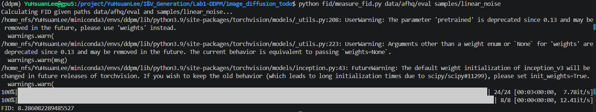

### Beta schedules (noise predictor)

| Schedule | FID | ᾱ_t < 0.5 at | ᾱ_t < 0.01 at |
|---|---|---|---|
| **linear** | **8.29** | t = 259 | t = 673 |
| quad | 13.08 | t = 418 | t = 850 |
| cosine | 14.56 | t = 496 | t = 935 |

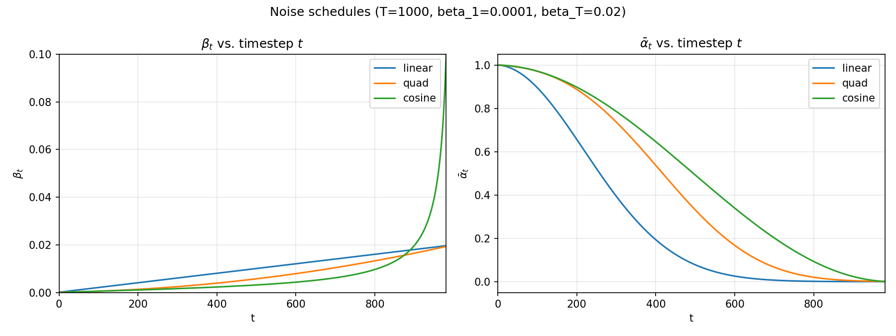

ᾱ_t is what actually controls how much of x₀ survives, and the contrast is sharp. Under the linear
schedule half the signal is gone by t ≈ 260 and the input is indistinguishable from pure noise from
t ≈ 670 onwards — roughly a third of the trajectory carries no information at all. Cosine reaches
that point only at t ≈ 935, spreading the corruption far more evenly.

That shows up directly in the reverse trajectories:

<table>
<tr><td width="12%"><b>linear</b></td><td>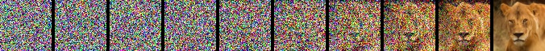</td></tr>
<tr><td><b>quad</b></td><td>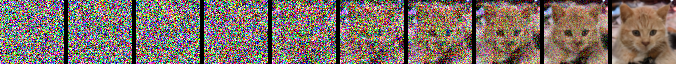</td></tr>
<tr><td><b>cosine</b></td><td>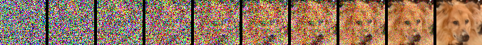</td></tr>
</table>

Under the linear schedule the first half of the reverse process does almost nothing visible, and all
the perceptually meaningful work is compressed into the last few hundred steps.

**All three clear the FID < 15 target, but cosine does not beat linear — linear is the best of the
three by a clear margin.** This does not contradict the analysis above; it shows that "wasting"
steps at high t is not the bottleneck here. Once the full 1000-step reverse process is run, those
uninformative steps cost sampling time but not sample quality, because the model simply passes
near-identical noise through them. Cosine's documented advantage comes mainly from harder, more
diverse datasets and from regimes where sampling steps are truncated; AFHQ at 64×64 is a narrow,
well-aligned domain that the linear schedule already fits well.

<table>
<tr><td width="12%"><b>quad</b></td>
<td>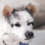</td></tr>
<tr><td><b>cosine</b></td>
<td>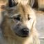</td></tr>
</table>

### Prediction targets (linear schedule)

| Predictor | FID | Visual quality |
|---|---|---|
| **noise** | **8.29** | sharp and varied |
| x₀ | 31.05 | recognisable but blurry |
| mean | 82.38 | unusable |

<table>
<tr><td width="12%"><b>noise</b></td>
<td></td></tr>
<tr><td><b>x₀</b></td>
<td>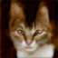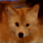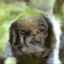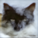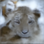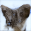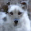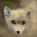</td></tr>
<tr><td><b>mean</b></td>
<td>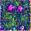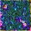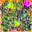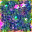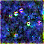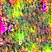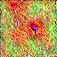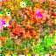</td></tr>
</table>

This reproduces the original DDPM paper's choice of the ε parameterization. The failure modes are
instructive:

**The mean predictor collapses to the identity map.** Evaluating the posterior-mean coefficients
for the linear schedule:

| t | 1 | 5 | 50 | 200 | 500 | 999 |
|---|---|---|---|---|---|---|
| coefficient of x₀ | 0.545 | 0.222 | 0.036 | 0.010 | 0.003 | 0.000 |
| coefficient of x_t | 0.455 | 0.778 | 0.964 | 0.990 | 0.994 | 0.990 |

For all but the very smallest timesteps the target is over 96% composed of x_t — that is,
μ̃_t ≈ x_t, and the network's regression target is almost identical to its own input. Unweighted MSE
is therefore minimised by learning the identity, without learning anything about the data. At
sampling time this is fatal: an identity map returns x_T essentially unchanged through all 1000
reverse steps, which is why the samples above are still noise. The tiny residual between μ̃_t and
x_t is precisely the part that performs the denoising, but it is numerically negligible and the
optimiser has no incentive to model it.

**The x₀ predictor is blurry** because it must commit to a complete image estimate at every step,
whereas the noise predictor only has to characterise the corruption and lets each reverse step
apply a small correction.

The loss curves tell the same story — note that the mean predictor's near-zero loss reflects the
identity shortcut, not success:

<table>
<tr>
<td width="33%">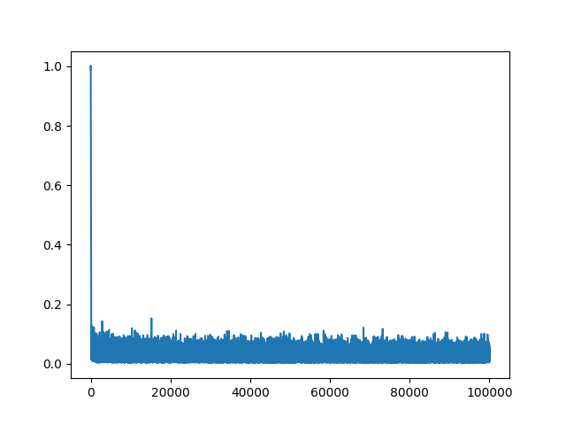</td>
<td width="33%">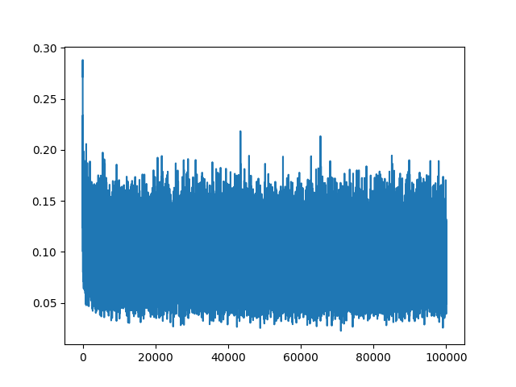</td>
<td width="33%">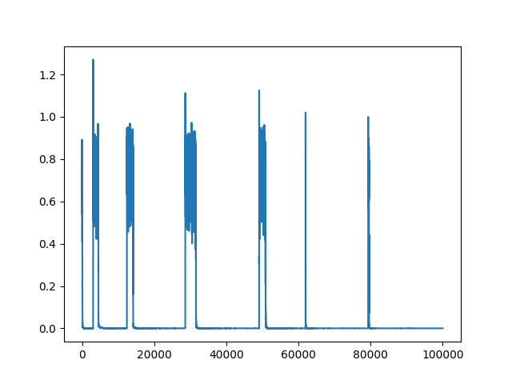</td>
</tr>
<tr>
<td align="center"><i>noise</i></td>
<td align="center"><i>x₀</i></td>
<td align="center"><i>mean</i></td>
</tr>
</table>

---

## 📂 Code structure

Files marked ✎ are the ones implemented for this assignment; the rest is provided scaffolding.

```
.
├── 2d_plot_diffusion_todo         (Task 1: Swiss Roll)
│   ├── dataset.py                 # Toy dataset (Swiss Roll, etc.)
│   ├── chamferdist.py             # Chamfer distance for evaluation
│   ├── network.py              ✎  # SimpleNet: time-conditioned noise estimator
│   ├── ddpm.py                 ✎  # q_sample, p_sample, p_sample_loop, compute_loss
│   └── ddpm_tutorial.ipynb        # Training & evaluation notebook
│
└── image_diffusion_todo           (Task 2: Image generation)
    ├── dataset.py                 # AFHQ loader & eval-set preparation
    ├── module.py                  # UNet building blocks
    ├── network.py                 # UNet
    ├── scheduler.py            ✎  # cosine schedule, add_noise, 3 predictor steps
    ├── model.py                ✎  # get_loss_x0, get_loss_mean
    ├── train.py                   # Training script
    ├── sampling.py                # Sampling script
    ├── tests/                     # Reference check for the implemented code
    └── fid/                       # FID evaluation tools
```

### What was implemented

**Task 1** — `SimpleNet` as a stack of `TimeLinear` layers with a linear output head (the predicted
noise is unbounded, so the head stays linear); `q_sample` as the closed-form forward process;
`p_sample` as one reverse step via the posterior mean and variance β̃_t; `p_sample_loop` as
Algorithm 2 of the DDPM paper; and the simplified noise-matching loss.

**Task 2** — the cosine schedule of Nichol & Dhariwal, built from T+1 ᾱ endpoints so consecutive
ratios yield exactly T betas, clipped at 0.999 to keep α_t strictly positive through the
singularity near t = T; `add_noise` as the image-space forward process; the three reverse-step
variants; and the x₀ / posterior-mean losses.

One detail worth flagging for anyone reading the code: all three `step_predict_*` functions require
**ᾱ₍ₜ₋₁₎ = 1 at t = 0**, not a clamped ᾱ₀. Getting this wrong makes the final reverse step return
`√ᾱ₀·x̂₀ + √α₀·x_t` instead of plain x̂₀. The bundled test suite exercises `t = 0` specifically.

---

## ⚙️ Reproducing

### Environment

```bash
conda create -n ddpm python=3.9 -y
conda activate ddpm
pip install -r requirements.txt
```

Run everything from inside the task directory — imports are bare, so the working directory matters.
Note that FID evaluation needs this environment rather than a newer one: SciPy removed the `disp`
argument from `linalg.sqrtm`, which `fid/measure_fid.py` relies on.

### Task 1

```bash
cd 2d_plot_diffusion_todo
jupyter lab ddpm_tutorial.ipynb
```

Training is 5000 iterations and takes a couple of minutes. A correct implementation reaches a
Chamfer distance below 20.

### Task 2

Verify the implementation against the reference values first — it runs on CPU in about a second and
catches sign and indexing errors before committing to a multi-hour run:

```bash
cd image_diffusion_todo
pytest tests/test_todo.py -q
```

Prepare the dataset (once — skipping this yields incorrect FIDs):

```bash
python dataset.py
```

Train. Each run is 100k iterations and took roughly 9–12 h on a single RTX 4090:

```bash
python train.py --mode {linear,quad,cosine} --predictor {noise,x0,mean} --gpu {INDEX}
```

The two experiment axes share the `linear + noise` baseline, so the five runs behind the tables
above are `{linear, quad, cosine} × noise` and `linear × {x0, mean}`. Checkpoints and
reverse-process trajectory figures land in
`results/predictor_{PREDICTOR}/beta_{SCHEDULE}/{TIMESTAMP}/`.

Sample and evaluate — the schedule and predictor are read from the checkpoint:

```bash
python sampling.py --ckpt_path {CKPT} --save_dir samples/{NAME}   # 500 images, the FID default
python fid/measure_fid.py data/afhq/eval samples/{NAME}
```

For the qualitative figures use `--num_samples 8 --save_traj` into a **separate** directory —
`measure_fid.py` measures every image in the directory it is given, so mixing figure samples into
the 500 would skew the score.
