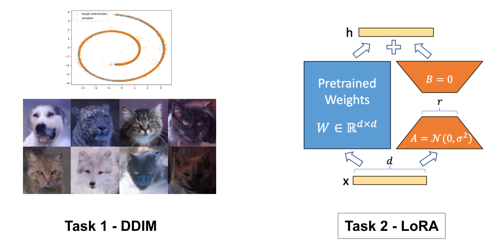
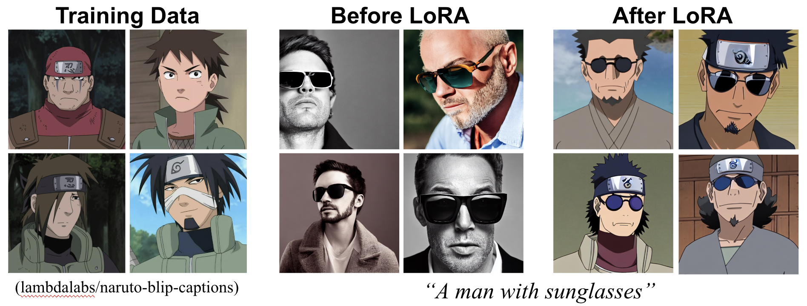
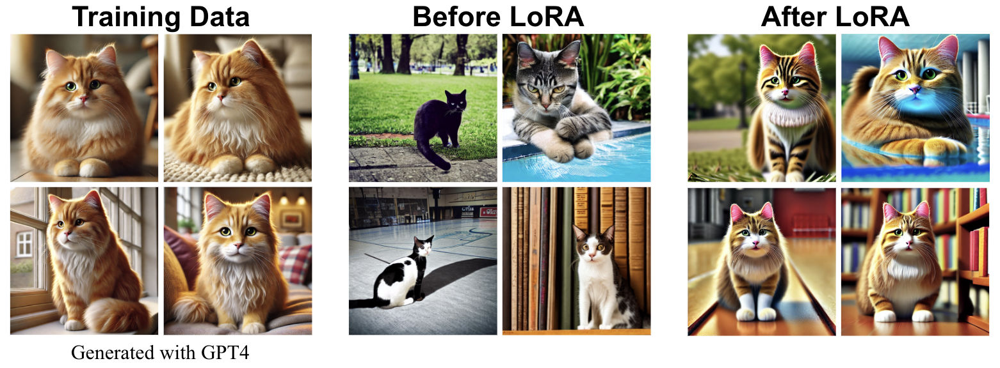

<div align=center>
  <h1>
  Denoising Diffusion Implicit Models (DDIM) and LoRA  
  </h1>
  <p>
    <b>NYCU: Image and Video Generation (2026 Fall)</b><br>
    Programming Assignment 2
  </p>
</div> 

<div align=center>
  <p>
    Instructor: <b>Yu-Lun Liu</b><br>
    TA: <b>Jing-En Huang</b><br>
    Assignment Design: <b>Huai-Hsun Cheng</b> <b>Siang-Ling Zhang</b>
  </p>
</div>

---

## 📘 Abstract


(1) **Denoising Diffusion Implicit Models (DDIM)** can generate samples with fewer reverse steps than DDPM. Sampling is deterministic when `eta=0` and stochastic when `eta>0`. In Task 1-1, the Swiss Roll notebook trains a DDPM for 5,000 iterations and then evaluates DDIM sampling. In Task 1-2, reuse a **noise-prediction image DDPM checkpoint from Lab 1**, vary the DDIM step count and eta, and evaluate image quality with FID.

(2) **LoRA (Low-Rank Adaptation)** is an efficient fine-tuning technique for neural networks that enables the customization of diffusion models with relatively small datasets, ranging from a few images to a few thousand. The main objective of Task 2 is to become familiar with the LoRA fine-tuning process for diffusion models. Instead of implementing LoRA from scratch, you will utilize a pre-existing LoRA module available in the diffusers library. This task will allow you to creatively develop and fine-tune a diffusion model tailored to your specific data and task requirements. Moreover, you will experiment with DreamBooth to create personalized diffusion models based on a particular subject of your choice.

- [Assignment Instructions (PDF)](./assets/Lab2-DDIM-LoRA.pdf)
- [Denoising Diffusion Implicit Models (DDIM) – arXiv](https://arxiv.org/pdf/2010.02502)
- [LoRA: Low-Rank Adaptation of Large Language Models – arXiv](https://arxiv.org/pdf/2106.09685)

---

## Scope and student editing rules

- Edit algorithm implementations only inside the marked **TODO blocks**. Carry over the required Lab 1 DDPM/network implementations into their existing TODO blocks, then implement the Lab 2 DDIM TODOs. Leave the fixed notebook training hyperparameters unchanged.
- For Task 2, edit only the marked **TODO configuration regions** in `task2/scripts/*.sh` and `task2/lora_inference.ipynb`. Configure the dataset, model/weight paths, prompts, output location and other exposed settings for your experiment. Defaults that already fit your experiment can stay unchanged. No LoRA implementation is required.

## ⚙️ Setup

### Environment
Create a `conda` environment and install dependencies:
```bash
conda create -n lab2-ddim-lora python=3.9 -y
conda activate lab2-ddim-lora
pip install -r requirements.txt
```
---

📂 Code Structure
```
.
├── task1 (Task 1: DDIM)
│   ├── 2d_plot_diffusion_todo (Task 1-1: Swiss Roll)
│   │   ├── chamferdist.py
│   │   ├── dataset.py
│   │   ├── ddpm.py                # TODO: Implement DDIM sampling (ddim_p_sample, ddim_p_sample_loop)
│   │   ├── ddpm_tutorial.ipynb
│   │   ├── __init__.py
│   │   └── network.py
│   └── image_diffusion_todo (Task 1-2: Image Generation)
│       ├── dataset.py            # AFHQ dataset loader
│       ├── fid                   # FID evaluation tools
│       ├── model.py              # Diffusion model
│       ├── module.py             # Basic modules of a prediction network
│       ├── network.py            # Prediction network
│       ├── sampling.py           # Image sampling script for both DDIM and DDPM
│       ├── scheduler.py          # TODO: Implement DDIM scheduler
│       └── train.py              # Training code
└── task2 (Task 2: LoRA)
    ├── lora_inference.ipynb
    ├── sample_data
    │   ├── artistic-custom
    │   └── dreambooth-cat
    ├── scripts
    │   ├── train_dreambooth_lora.sh  # Training script for DreamBooth + LoRA
    │   ├── train_lora_custom.sh      # Training script for LoRA w/ custom data
    │   └── train_lora.sh             # Training script for LoRA
    ├── train_dreambooth_lora.py      # Training code for DreamBooth + LoRA
    ├── train_lora.py                 # Training code for LoRA
    └── utils.py
```
---
<h2><b>📝 Task 1 – DDIM</b></h2>

<h3><b>Task 1-1: Swiss Roll DDIM</b></h3>

> Implement and test DDIM sampling on a 2D Swiss Roll dataset.

**Key TODOs:**

- DDIM sampling functions: `ddim_p_sample`, `ddim_p_sample_loop` (ddpm.py)

Start the notebook from its own directory so imports and reference-image paths resolve correctly:

```bash
cd task1/2d_plot_diffusion_todo/
jupyter lab ddpm_tutorial.ipynb
```

Run all cells in order. The notebook trains a fresh Swiss Roll model for **5,000 iterations**, then evaluates DDPM and DDIM using that in-memory model. **Do not load Lab 1 weights for Swiss Roll.** Keep the supplied training hyperparameters unchanged. Include explanations of the TODO implementations, the DDIM evaluation figure and a screenshot of its Chamfer distance in the report.

**Chamfer Distance and repeated sampling:** The DDIM Chamfer Distance target is **< 40**. Each sampling call draws new initial noise, so the score can vary between runs even when `eta=0`; an individual run can exceed 40 with a correct implementation. You may rerun the final **DDIM evaluation cell** without retraining or editing the notebook. Keep the trained model, reference points, inference steps and eta unchanged. Repeated sampling may produce a score below 40, but does not guarantee it. Submit the figure and Chamfer Distance screenshot from the same evaluation run.

<h3><b>Task 1-2: Image Generation with DDIM</b></h3>

> Extend DDIM sampling on image diffusion.

**Key TODOs:**

- `DDIMScheduler.set_inference_timesteps` and `DDIMScheduler.step` (`scheduler.py`). DDIM in this assignment uses the **noise predictor**.

**Experiments:**

- Reuse one Lab 1 image checkpoint trained with `predictor=noise`; image DDPM retraining is not required for Lab 2.
- Run every combination of `ddim_steps = {10, 20, 50, 100, 1000}` and `eta = {0.0, 0.2, 0.5, 1.0}`: **20 sampling runs and 20 FID measurements**.
- The sampling code inherits the checkpoint's training beta schedule exactly. Keep that schedule fixed across the 20 runs. Predictors `x0` and `mean`, and additional schedule comparisons, are outside the required experiments.
- Include explanations of the DDIM TODOs, a 4-by-5 FID table and discussion of the results in the report.

**🚀 Usage**

**DDIM Sampling**
```bash
cd task1/image_diffusion_todo/
python sampling.py --ckpt_path {CKPT} --save_dir {SAVE_DIR} \
--sample_method ddim \
--ddim_steps {DDIM_STEPS} \
--eta {ETA}
```
> **Parameters:** \
> `--sample_method`: ddpm, ddim \
> `--ddim_steps`: Number of DDIM inference steps \
> `--eta`: DDIM eta parameter

Predictor metadata is read from the checkpoint. If an older Lab 1 checkpoint does not contain predictor metadata, pass `--predictor noise` explicitly after confirming it was trained to predict noise. A conflicting predictor override is rejected. Use a separate sample directory for each `(ddim_steps, eta)` combination; each run produces 500 images for FID.

**Evaluation**

From `task1/image_diffusion_todo/`:

```bash
python dataset.py   # Run once to prepare AFHQ eval set
python fid/measure_fid.py data/afhq/eval/ {SAVE_DIR}
```

Run the FID command once for each of the 20 sample directories. Use the prepared `data/afhq/eval/` directory as the reference set.

<h2><b>📝 Task 2 – LoRA</b></h2>

**Key TODOs:**

- Task 2-1: train one style LoRA using **either** a public dataset **or** a custom dataset.
- Task 2-2: train DreamBooth with LoRA on one identity.
- Configure and run the provided scripts and inference notebook. No LoRA algorithm implementation is required. Authenticate with Hugging Face and confirm access to the selected base model before starting.

The training scripts default to `MIXED_PRECISION="no"`. To use fp16 training on a compatible GPU, set `MIXED_PRECISION="fp16"` in the script's TODO configuration region.

<h3><b>Task 2-1. Train LoRA on a Specific Visual Style</b></h3>

> Train a LoRA for a specific "style". It could be artistic, cinematic, photographic, or any other visual style. You have two options to choose a dataset for training LoRA.


**(Option 1) Use an open-source dataset**

You can utilize various open-source image-caption datasets for LoRA training, many of which are available on Hugging Face. For instance, you can explore datasets listed here. By replacing the `DATASET_NAME` argument with the desired dataset, you can seamlessly train LoRA with new data. Additionally, you are welcome to use any other open-source datasets, provided that you clearly cite the appropriate references.


**🚀 Usage**

We provide the code for LoRA training of Stable Diffusion 1.4 in train_lora.py. You can simply run the code using:

```bash
cd task2/
sh scripts/train_lora.sh
```

The default training dataset is set as:
```bash
export DATASET_NAME="lambdalabs/naruto-blip-captions"
```
which consists of Naruto images with synthetic captions generated with [BLIP-2](https://github.com/salesforce/BLIP). The below image shows the outputs of Stable Diffusion before and after LoRA training on this dataset. You can first check if LoRA works properly based on this dataset. The validation images after each epoch will be stored in {$output_dir}/validation/.

A simple inference code for Stable Diffusion with LoRA is provided at [lora_inference.ipynb](task2/lora_inference.ipynb). Set the selected base model and your trained LoRA output path in its TODO configuration region.



(Credit: lambdalabs/naruto-blip-captions)

**(Option 2) Prepare your own dataset**

If you want to try training LoRA on your own creative dataset, you can refer to `task2/scripts/train_lora_custom.sh` for the necessary arguments to train on a custom dataset. Be sure to update the `TRAIN_DATA_DIR` to point to the directory containing your data. We provide a sample dataset in `task2/sample_data/artistic-custom` consisting of four images, which were generated using GPT-4. The image below showcases the results of LoRA training on this sample dataset.

**🚀 Usage**

Refer to [this link](https://huggingface.co/docs/datasets/v2.4.0/en/image_load#imagefolder) for how to organize the dataset folder. Then, train the LoRA using:

```bash
sh scripts/train_lora_custom.sh
```

<h3><b>Task 2-2. Train DreamBooth with LoRA on a Specific Identity</b></h3>

> Your objective is to train a DreamBooth model with LoRA to accurately capture and reproduce the identity of a specific subject. This subject could be anything personally meaningful to you, such as your own face, your pet, a favorite doll, or any other identifiable entity.
>
> [DreamBooth](https://arxiv.org/abs/2208.12242) is a fine-tuning technique that allows diffusion models to learn a unique identifier for a specific subject, enabling the generation of images featuring that exact subject post-training. By combining DreamBooth with LoRA, you can achieve this fine-tuning with only a small number of images and in a relatively short time frame.

**🚀 Usage**

You can run DreamBooth + LoRA using:

```bash
sh scripts/train_dreambooth_lora.sh
```

We provide a sample dataset for training DreamBooth in `task2/sample_data/dreambooth-cat/`. To use your own data, update `INSTANCE_DIR` in the script's TODO configuration region.

For both Task 2-1 and Task 2-2, describe the dataset and its source, and include training-image examples and generated images with their text prompts in the report. Use the inference notebook's TODO configuration region to select the corresponding trained weights.



<h2><b>📦 Submission</b></h2>

Submit a single zip file {ID}_lab2.zip including:

- Report (report.pdf)
- The complete Task 1 code, excluding training checkpoints, datasets, generated sample directories and Inception weights.
- Two text files containing the cloud links to your trained LoRA weights: `task2/{ID}_task2-1_lora_weight.txt` for the style model and `task2/{ID}_task2-2_lora_weight.txt` for the identity model.

Example:
```
{ID}_lab2.zip
├── report.pdf
├── task1
│   ├── 2d_plot_diffusion_todo
│   │   ├── __init__.py
│   │   ├── chamferdist.py
│   │   ├── dataset.py
│   │   ├── ddpm_tutorial.ipynb
│   │   ├── ddpm.py
│   │   └── network.py
│   └── image_diffusion_todo
│       ├── dataset.py
│       ├── model.py
│       ├── module.py
│       ├── network.py
│       ├── sampling.py
│       ├── scheduler.py
│       └── train.py
└── task2
    ├── {ID}_task2-1_lora_weight.txt
    └── {ID}_task2-2_lora_weight.txt
```
